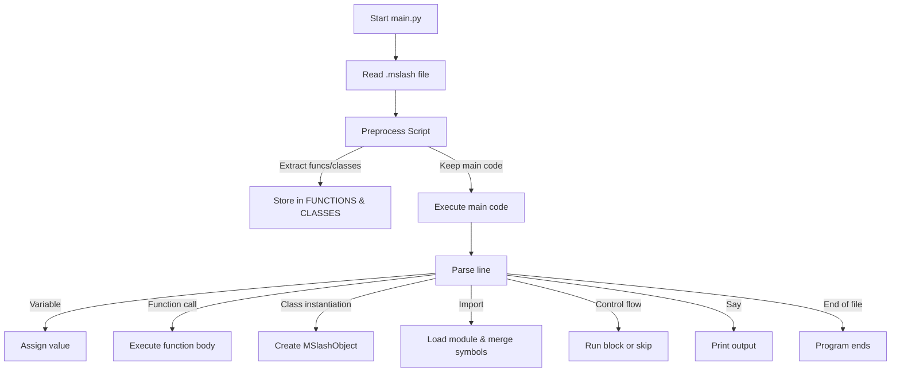

# MSlash Script Interpreter

 A lightweight Python-based interpreter for the **MSlash** scripting language — human-friendly syntax with variables, functions, classes, and modular imports.

---

## ✨ Features

| Feature                       | Syntax Example                                    | Notes |
|--------------------------------|--------------------------------------------------|-------|
| Variables                      | `var name = "John"`                              | Supports numbers, strings, lists, and Vata (dictionary) literals |
| String interpolation           | `say "Hello, ${name}!"`                          | Works inside `say`, `math`, and assignments |
| Functions                      | `func add(a,b) ... endfunc`                      | Return values with `return` |
| Classes & Methods              | `class Foo ... func init(...) ... endclass`      | OOP-style with `this` |
| Imports (`steal`)               | `steal myFunc from utils.mslash`                 | Imports from another `.mslash` file |
| Conditionals                   | `if x > 5 ... else ... endif`                    | Supports nesting |
| Loops                          | `loop 3 ... endloop`                             | Fixed-count loops |
| Math expressions               | `math 5 * (2 + 3)`                               | Evaluates and prints result |
| Inline comments                | `{ comment }`                                    | Skipped during execution |
| User input                     | `input username`                                 | Stores into a variable |
| Empty lines                    | `emptyline 3`                                    | Prints blank lines |
| Pause execution                | `pause`                                          | Waits for Enter key |
| Terminate script                | `break`                                          | Ends execution immediately |

---

## 📦 Installation

**Requirements:**
- Python **3.8+**  
- No external dependencies — **pure Python**.

**Setup:**
1. Save `main.py` in your project directory.
2. Create `.mslash` files for your scripts.
3. Run scripts with:
   ```bash
   python main.py your_script.mslash
    ```

If you rename `main.py`, just run:

```bash
python renamedmain.py your_script.mslash
```

---

## ▶️ Usage

Run:

```bash
python main.py your_script.mslash
```

Debug mode:

```bash
python main.py -d your_script.mslash
```

Without arguments:

```bash
python main.py
```

It will prompt:

```
Enter the name and file extension of the target file (e.g., demo.mslash):
```

---

## 📜 Language Reference

### Variables

```plaintext
var name = "John"
var age = 30
say "Name: ${name}, Age: ${age}"
```

### Functions

```plaintext
func greet(person)
    say "Hello, ${person}!"
endfunc

greet("Alice")
```

### Classes

```plaintext
class Person
    func init(name, age)
        var this.name = name
        var this.age = age
    endfunc

    func introduce()
        say "I am ${this.name}, ${this.age} years old."
    endfunc
endclass

var p = new Person("Bob", 25)
p.introduce()
```

### Conditionals

```plaintext
var num = 7
if num > 5
    say "Greater than 5"
else
    say "5 or less"
endif
```

### Loops

```plaintext
loop 3
    say "Hello!"
endloop
```

### Inline Comments

```plaintext
{ This is a comment }
var x = 42  { Comment after code }
```

### String Interpolation

```plaintext
var name = "MSlash"
say "Hello, ${name}!"
```

### User Input

```plaintext
input userName
say "Welcome, ${userName}!"
```

### Math

```plaintext
math 3 * (4 + 5)
```

### Empty Lines

```plaintext
emptyline 2
say "This appears after 2 blank lines."
```

### Pause

```plaintext
say "Press enter to continue..."
pause
```

### Break

```plaintext
say "Stopping now."
break
```

---

## 📦 Imports and Modularity

Use `steal` to import from another `.mslash` file.

**utils.mslash**

```plaintext
func multiply(a, b)
    return a * b
endfunc

func getGreeting()
    return "Hello from utils!"
endfunc
```

**main.mslash**

```plaintext
steal multiply from utils.mslash
steal getGreeting from utils.mslash

var product = multiply(6, 7)
say "6 * 7 = ${product}"
say "${getGreeting()}"
```

---

## 📊 Execution Flow Diagram



---

## 🧪 Quick Demo

**utils.mslash**

```plaintext
func multiply(a, b)
    return a * b
endfunc

func getGreeting()
    return "Hello from utils!"
endfunc
```

**demo.mslash**

```plaintext
var name = "World"
say "Hello, ${name}!"

func add(a, b)
    return a + b
endfunc

var result = add(5, 7)
say "5 + 7 = ${result}"

steal multiply from utils.mslash
steal getGreeting from utils.mslash

var product = multiply(3, 4)
say "3 * 4 = ${product}"
say "${getGreeting()}"

class Greeter
    func init(who)
        var this.target = who
    endfunc

    func greet()
        say "Greetings, ${this.target}!"
    endfunc
endclass

var g = new Greeter("MSlash User")
g.greet()
```

Run:

```bash
python main.py demo.mslash
```

Expected Output:

```
Hello, World!
5 + 7 = 12
3 * 4 = 12
Hello from utils!
Greetings, MSlash User!
```

---

## 💡 Best Practices

* Always close blocks (`endif`, `endloop`, `endfunc`, `endclass`).
* Keep `steal` imports at the top.
* Use `this.var` only inside methods.
* Comment generously with `{ }`.

---

## 🛠 Developer Notes

To add new commands:

* Edit the `execute()` function in `main.py`.
* Add a new `elif original_line.startswith("cmd ")` block.

To add built-ins:

* Edit `safe_eval()`’s `allowed_builtins` dict.

---

## 📜 License

```
Copyright (c) 2025 Sahil Das

Permission is hereby granted, free of charge, to any person obtaining a copy
of this software and associated documentation files (the "Software"), to deal
in the Software for commercial and non-commercial purposes, including without limitation
the rights to use, copy, modify, merge, publish, distribute, sublicense, and/or
sell copies of the Software, and to permit persons to whom the Software is furnished
to do so, subject to the following conditions:

1. Attribution is mandatory:
   All copies or substantial portions of the Software, whether in source or binary form, must include
   a clear attribution to the original author:
   "MSlash Script Interpreter by Sahil Das"

2. This permission notice shall be included in all copies or substantial portions of the Software.

3. The Software is provided "as is", without warranty of any kind, express or implied, including
   but not limited to the warranties of merchantability, fitness for a particular purpose and
   noninfringement. In no event shall the authors or copyright holders be liable for any claim,
   damages or other liability, whether in an action of contract, tort or otherwise, arising from,
   out of or in connection with the Software or the use or other dealings in the Software.
```
